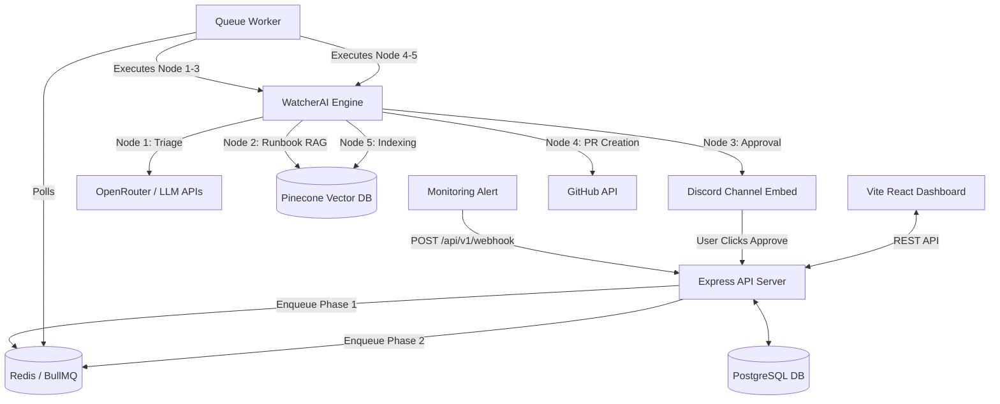

# 01 System Overview

## Purpose of the Project
WatcherAgent acts as an autonomous, self-healing orchestration platform. It is designed to ingest alerts from monitoring tools (e.g., Sentry, Datadog), analyze the root cause of the crash, and programmatically generate a fix via a GitHub Pull Request.

## Business Problem It Solves
Production incidents cause costly downtime and require significant engineering hours to triage, debug, and patch. WatcherAgent eliminates human delay by bridging observability tools directly with version control systems. It provides zero-cost resolution for recurring bugs by keeping a vector memory (Pinecone) of past patches, preventing engineers from solving the same problem twice.

## Main Features
- **Deterministic Triage**: Automatically maps incoming alerts to 11 specific categories (e.g., `DATABASE`, `HTTP_5XX`).
- **Semantic Vector Memory**: Remembers past fixes in Pinecone to instantly resolve recurring incidents.
- **Interactive Discord Gateway**: Requires a developer to click "Accept & Fix" before generating the PR.
- **Enterprise Safety Guardrails**: Hard limits on file modifications (max 30% change) and JSON syntax checks to prevent destructive AI behavior.

## Overall Architecture Style
WatcherAgent utilizes a **Hybrid Architecture** combining:
- **Microservices / Decoupled Worker Model**: An Express.js API server handles lightweight HTTP tasks and webhooks, while a separate background worker (`BullMQ`) handles heavy lifting.
- **Event-Driven & Queue-Based**: Webhooks trigger asynchronous jobs in a Redis-backed queue. Callback events from Discord (Human-in-the-loop) re-trigger downstream pipeline phases.
- **Layered Architecture**: The `server/src` directory follows a layered structure (Controllers → Services/Queue → Database/Models).

### High-Level System Architecture Diagram

## Technology Stack

### Backend
- **Runtime**: Node.js v20+
- **Language**: TypeScript (for `server/` and `worker/`), JavaScript (for `watcherai/` nodes)
- **Framework**: Express.js
- **Queue/Jobs**: BullMQ with Redis
- **Database**: PostgreSQL (managed via `pg` driver natively in `server/`)

### Frontend
- **Framework**: React 19, Vite
- **Styling**: TailwindCSS v4
- **State/Routing**: React Router (inferred based on SPA architecture)

### Alternative Frontend / Service (Watcher Next.js App)
- **Framework**: Next.js 16 (App Router)
- **Database ORM**: Prisma (`@prisma/client`)
- **Authentication**: `better-auth`
- **UI Components**: Radix UI / Shadcn UI

### AI & External Integrations
- **LLM Orchestration**: OpenRouter, OpenAI, Anthropic, Gemini APIs
- **Vector Database**: Pinecone
- **Version Control**: GitHub API (Octokit)
- **Communication**: Discord.js
