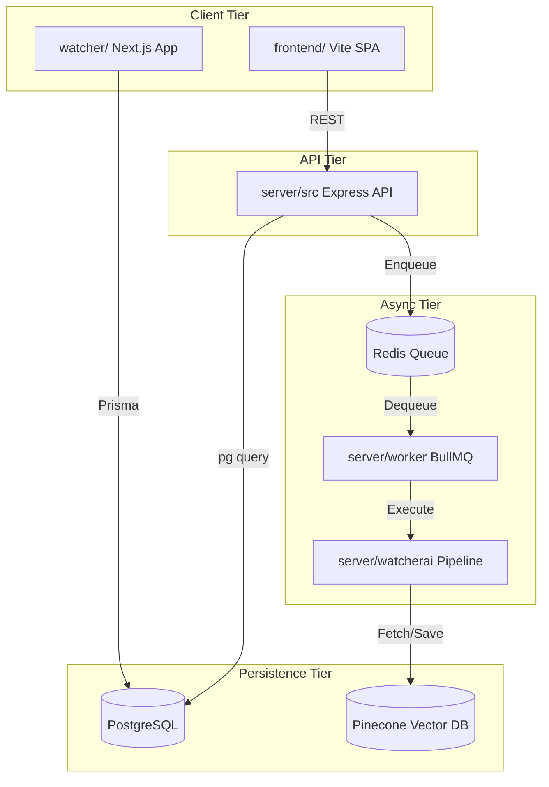

# 02 Repository Structure

The WatcherAgent repository is structured as a decoupled monorepo. It contains distinct services operating in tandem to achieve the complete orchestration flow.

## Root Directory

| Folder | Responsibility | Main Files |
|--------|----------------|------------|
| `server/` | The core backend Express API and the AI engine nodes. | `src/index.ts`, `watcherai/`, `worker/` |
| `frontend/` | The Vite + React 19 client dashboard. | `src/App.jsx`, `src/index.css` |
| `watcher/` | An independent Next.js 16 application using Prisma, likely an evolved version of the dashboard or a SaaS wrapper. | `app/`, `prisma/schema.prisma` |
| `nginx/` | Reverse proxy configuration for Docker deployments. | `default.conf` |
| `mocks/` | Mock webhook payloads for testing ingestion. | `pagerduty/*.json` |

## `server/` Sub-Directory

This is the heart of the system.

### `server/src/` (Express API)
- **Responsibility**: Handles all incoming HTTP requests (auth, UI data fetching, monitoring webhooks, Discord callbacks).
- **Public Exports**: The Express application instance mounted to `PORT 3001`.
- **Internal Dependencies**: Depends on `server/watcherai` for mock triggering and `server/src/db` for persistence.
- **Key Folders**:
  - `controllers/`: Handles request parsing and HTTP responses.
  - `routes/`: Maps URIs to controller functions.
  - `db/`: Initializes the raw PostgreSQL connection (`pg` pool).
  - `models/`: TypeScript interfaces for database rows.
  - `middleware/`: Error handling and potentially auth guards.
  - `queue/`: Functions to push jobs to BullMQ.

### `server/worker/` (Queue Processor)
- **Responsibility**: A separate Node.js process that polls BullMQ/Redis for `INCIDENT_INGESTION` and `INCIDENT_FIX` jobs.
- **Main Files**: `src/processor.ts` or `src/index.ts`.
- **Internal Dependencies**: Tightly coupled to `server/watcherai`, as it executes the AI nodes asynchronously.
- **Reverse Dependencies**: The `docker-compose.yml` mounts this as an independent `watcher-worker` container.

### `server/watcherai/` (The AI Engine)
- **Responsibility**: The deterministic LLM pipeline. It is intentionally modularized into 5 distinct nodes.
- **Main Files**: `index.js`, `nodes/node-01-triage/`, `nodes/node-02-runbook/`, etc.
- **Internal Dependencies**: Connects externally to Pinecone, OpenRouter, GitHub, and Discord.
- **Reverse Dependencies**: Imported and executed by `server/worker/`.

## `frontend/` Sub-Directory
- **Responsibility**: Provides the client-side SPA UI for monitoring incidents.
- **Main Files**: `src/App.jsx`, `src/components/ProjectModal.jsx`.
- **Internal Dependencies**: Depends on Vite, React 19, and TailwindCSS v4.
- **Reverse Dependencies**: N/A, runs in browser.

## `watcher/` Sub-Directory
- **Responsibility**: A Next.js application representing user management, instances, and job tracking using Prisma and Supabase/Better Auth.
- **Main Files**: `prisma/schema.prisma`, `app/pricing/page.tsx`.
- **Internal Dependencies**: Prisma Client, Radix UI, Better Auth.
- **Reverse Dependencies**: Potentially deployed separately from the main `docker-compose.yml` stack, representing a multi-tenant SaaS frontend.

## Dependency Graph Diagram

## Key Takeaways
- The repository follows a separation of concerns by splitting the synchronous HTTP API (`server/src`) from the asynchronous job execution (`server/worker`).
- The AI logic (`server/watcherai`) acts as a shared library consumed by the worker.
- The presence of two frontend architectures (`frontend/` and `watcher/`) suggests a transition phase in the project's lifecycle, likely moving from a simple SPA to a full-stack Next.js SaaS architecture.
