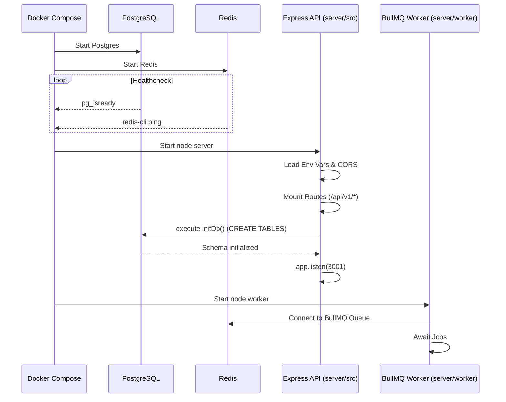

# 03 Application Startup Flow

The WatcherAgent stack is designed to run via Docker Compose, which coordinates the initialization of PostgreSQL, Redis, the Express API Server, the BullMQ Worker, and the NGINX proxy.

## Startup Sequence

1. **Environment & Orchestration (`docker-compose.yml`)**
   - **Database Initialization**: The `postgres:15-alpine` container starts first.
   - **Redis Initialization**: The `redis:7-alpine` container starts alongside Postgres.
   - Both containers have health checks (`pg_isready` and `redis-cli ping`).

2. **Express API Server (`server/src/index.ts`)**
   - Waits for Postgres and Redis to be healthy (`depends_on`).
   - Starts the Node.js process and loads environment variables.
   - **Configuration Loading**: Parses `process.env` (e.g., `DATABASE_URL`, `ALLOWED_ORIGINS`).
   - **Middleware Registration**: Mounts CORS, JSON parser, and health check route.
   - **Router Mounting**: Registers modular routes (`/api/v1/...`) via `server/src/routes/index.ts`.
   - **Database Initialization**: Calls `initDb()` from `server/src/db/index.ts`.
     - Executes raw SQL `CREATE TABLE IF NOT EXISTS` for `users`, `projects`, `incidents`, and `runs`.
     - Automatically runs schema patches (e.g., `ALTER TABLE incidents ADD COLUMN ...`).
     - **Constraint Setup**: Creates index `idx_incidents_dedup` to protect against ingestion storms.
   - **Server Listening**: Finally calls `app.listen(PORT)` on port 3001.

3. **Background Queue Worker (`server/worker/src/index.ts` / `processor.ts`)**
   - Starts independently as `watcher-worker`.
   - Connects to the Redis instance to listen for BullMQ jobs.
   - Imports the core `WatcherAI` module (`runPhase1`, `runPhase2`).

4. **Next.js Watcher App (`watcher/`) (Optional SaaS Frontend)**
   - Bootstraps Next.js 16 App Router.
   - Initializes Prisma Client (`@prisma/client`) connecting to the same (or separate) PostgreSQL instance.
   - Starts the dev/prod server (`next dev` or `next start`).

## Mermaid Startup Sequence Diagram

## Key Files Involved
- `docker-compose.yml`: Root orchestrator.
- `server/src/index.ts`: Entry point for API.
- `server/src/db/index.ts`: Raw SQL table creation and DB pool.
- `server/worker/src/processor.ts`: Worker initialization and job execution definitions.

## Key Takeaways
- The lack of an external ORM migration tool in the API server is mitigated by raw SQL `CREATE TABLE IF NOT EXISTS` patches running synchronously before the server accepts traffic.
- The Worker relies entirely on the API server for populating the database, though it can start concurrently.
