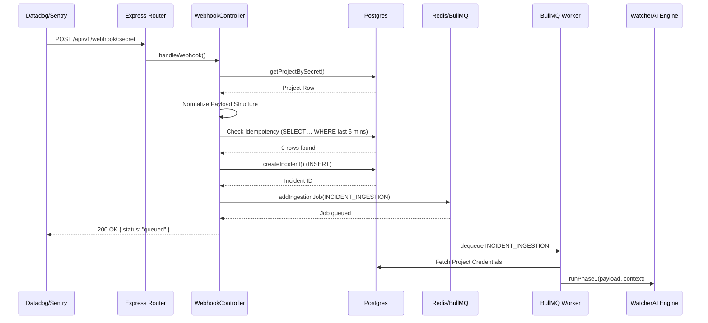

# 04 Request Lifecycle

To illustrate the complete request lifecycle, we will trace the ingestion of an alert via the Webhook API endpoint: `POST /api/v1/webhook/:secret`.

## Complete Request Flow

1. **Client / External Monitoring System**
   - Sentry, Datadog, or PagerDuty fires a webhook payload upon an application crash.

2. **Express Router (`server/src/routes/index.ts` -> `webhook.routes.ts`)**
   - Receives the `POST` request at `/api/v1/webhook/:secret`.
   - Routes the request to the controller function `handleWebhook`.

3. **Controller - Authentication & Validation (`server/src/controllers/webhook.controller.ts`)**
   - **File**: `server/src/controllers/webhook.controller.ts`
   - **Function**: `handleWebhook(req, res)`
   - Extracts the `secret` from URL params.
   - Calls the `getProjectBySecret(secret)` model function to authenticate the webhook. Returns `404` if invalid.

4. **Controller - Payload Normalization (`handleWebhook`)**
   - The controller implements complex conditional logic to detect the webhook source (Sentry, Grafana, Datadog, PagerDuty, Render).
   - Extracts and standardizes: `service`, `errorSignature`, `incidentId`, `triggeredAt`, and numeric metrics (`latencyMs`, `errorRate`).
   - Creates a normalized `mappedPayload`.

5. **Controller - Idempotency & Deduplication Check**
   - **Database Query**: Executes a raw SQL query against `incidents` checking for existing incidents matching the `project_id`, `error_signature`, or `external_incident_id` within the last 5 minutes.
   - If a duplicate exists, returns a `status: 'duplicate'` early response.

6. **Repository Layer - Incident Creation (`server/src/models/incident.ts`)**
   - **Function**: `createIncident(...)`
   - Executes `INSERT INTO incidents` with status `TRIGGERED`.

7. **Queue Service - Enqueuing Job (`server/src/queue/index.ts`)**
   - **Function**: `addIngestionJob(incident.id, mappedPayload)`
   - Pushes an `INCIDENT_INGESTION` job to the BullMQ Redis instance.

8. **Controller - Response**
   - Returns a HTTP 200 JSON response: `{ status: 'queued', incident_id: '...' }` back to the monitoring provider.

9. **Asynchronous Worker Processing (`server/worker/src/processor.ts`)**
   - **Function**: `processQueueJob(jobName, data)`
   - Dequeues `INCIDENT_INGESTION`.
   - Fetches full incident and project config via SQL.
   - Calls `runPhase1(payload, context)` from the `WatcherAI` library.
   - Updates the database to `AWAITING_APPROVAL`.

## Request Lifecycle Diagram

## Error Handling
- The entire `handleWebhook` logic is wrapped in a `try...catch` block.
- Any unhandled exceptions print to `console.error` and return a generic `500 Internal Server Error` response to prevent leaking internal stack traces.

## Key Takeaways
- The request explicitly operates synchronously up to the point of data persistence (PostgreSQL) and job enqueuing (Redis). The response to the webhook provider is deliberately decoupled from the slow AI execution step to prevent HTTP timeouts.
- Idempotency checks rely on a 5-minute rolling time window, ensuring that burst alerts for a single error signature yield only one PR.
