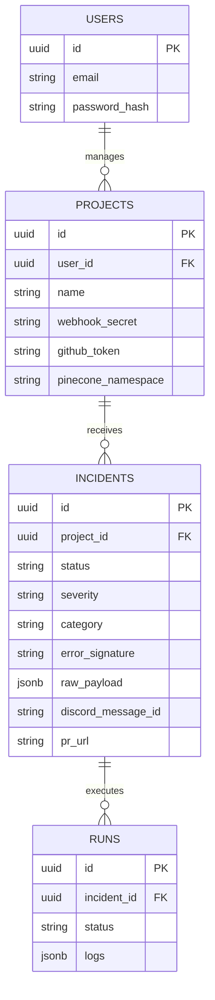

# 07 Database Architecture

WatcherAgent employs a dual-database architecture. The core pipeline utilizes a PostgreSQL relational database, while the AI pipeline leverages Pinecone for semantic vector memory. Note that within PostgreSQL, there are two distinct schema definitions due to the repository's structure (`server/` raw SQL vs `watcher/` Prisma).

## 1. Core Server Schema (Raw SQL)
Managed by `server/src/db/index.ts`. Uses raw `CREATE TABLE IF NOT EXISTS` commands instead of a traditional migration tool.

### Tables
- **`users`**: Administrator accounts.
  - Columns: `id (UUID)`, `email`, `name`, `password_hash`, `created_at`.
- **`projects`**: The core configuration unit connecting an external repository to the AI.
  - Columns: `id`, `user_id` (FK), `name`, `webhook_secret` (UNIQUE), `github_owner`, `github_repo`, `github_token`, `discord_channel_id`, `openrouter_key`, `pinecone_namespace`, `active`.
  - Relationships: Belongs to `users`.
- **`incidents`**: Central entity for a fired webhook alert.
  - Columns: `id`, `project_id` (FK), `status` (TRIGGERED, AWAITING_APPROVAL, CLOSED_AND_LEARNED, FAILED), `severity`, `category`, `error_signature`, `raw_payload` (JSONB), `triage` (JSONB), `runbook` (JSONB), `root_cause`, `pr_url`.
  - Relationships: Belongs to `projects`.
- **`runs`**: Audit logs for a single incident execution phase.
  - Columns: `id`, `incident_id` (FK), `status`, `started_at`, `completed_at`, `logs` (JSONB).

### Indexes
- `idx_incidents_dedup`: An index on `(project_id, error_signature, status, created_at DESC)` optimized to rapidly detect if an incoming webhook is a duplicate of a recently triggered incident.

## 2. Watcher SaaS Schema (Prisma)
Managed by `watcher/prisma/schema.prisma`. 

### Models
- **`User`, `Session`, `Account`, `Verification`**: Auth models for Better Auth / NextAuth.
- **`Instance`**: Represents a deployed Watcher instance.
- **`Job`**: Generic job tracking table (`prompt`, `containerId`, `result` JSON).
- **`InstanceConfig`**: Detailed API keys (encrypted) and port configurations.

## Database Entity Relationship Diagram (Core Server)

## Key Takeaways
- The use of `JSONB` for `raw_payload` and `triage` in the `incidents` table allows the system to flexibly ingest diverse webhook schemas (Datadog, Sentry, PagerDuty) without requiring rigid schema updates.
- The `idx_incidents_dedup` index is a critical architectural choice ensuring that high-throughput cascading failures (e.g., thousands of identical errors per minute) are deduplicated efficiently at the database level rather than the application layer.
