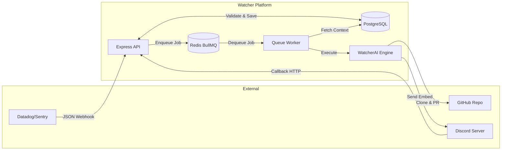
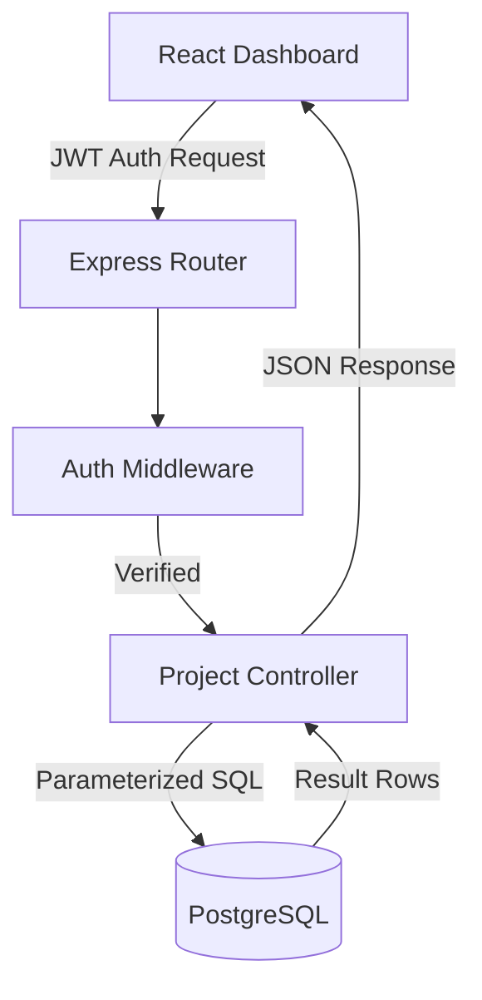
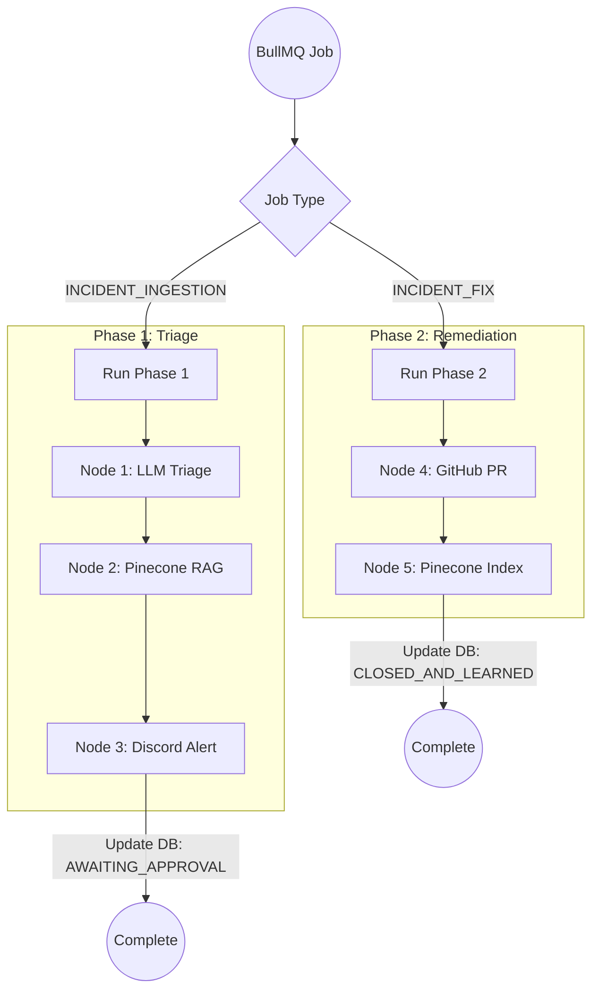
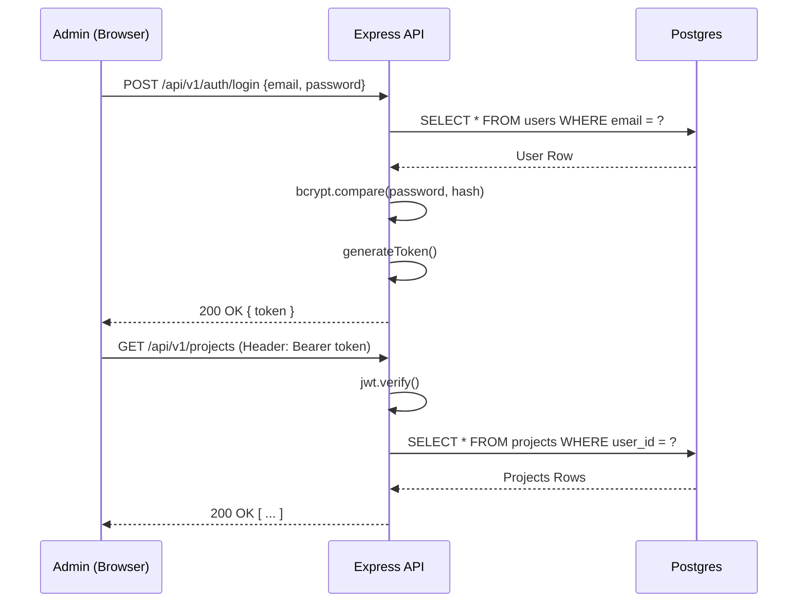

# 14 Data Flow Diagrams

This document visualizes the exact flow of data through the WatcherAgent system.

## 1. Overall System Data Flow

## 2. API to Database Flow

## 3. Worker Execution Flow (Phase 1 & Phase 2)

## 4. Authentication Flow

