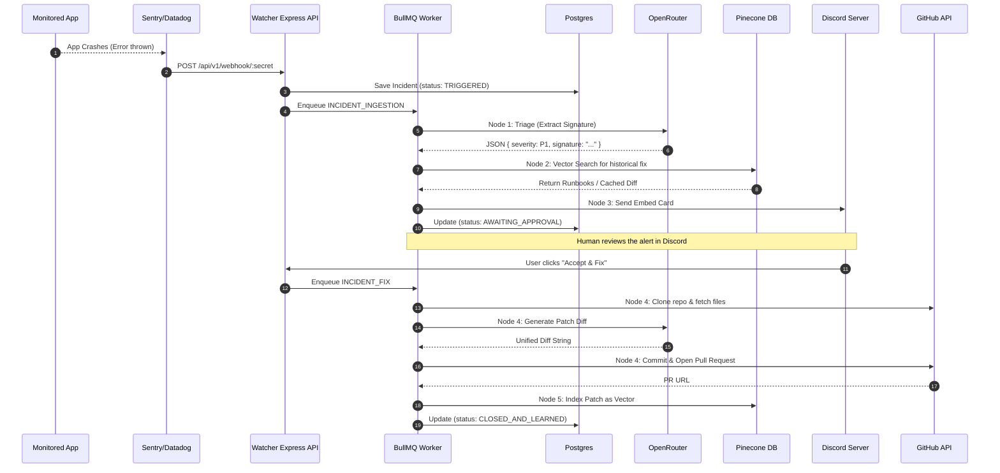
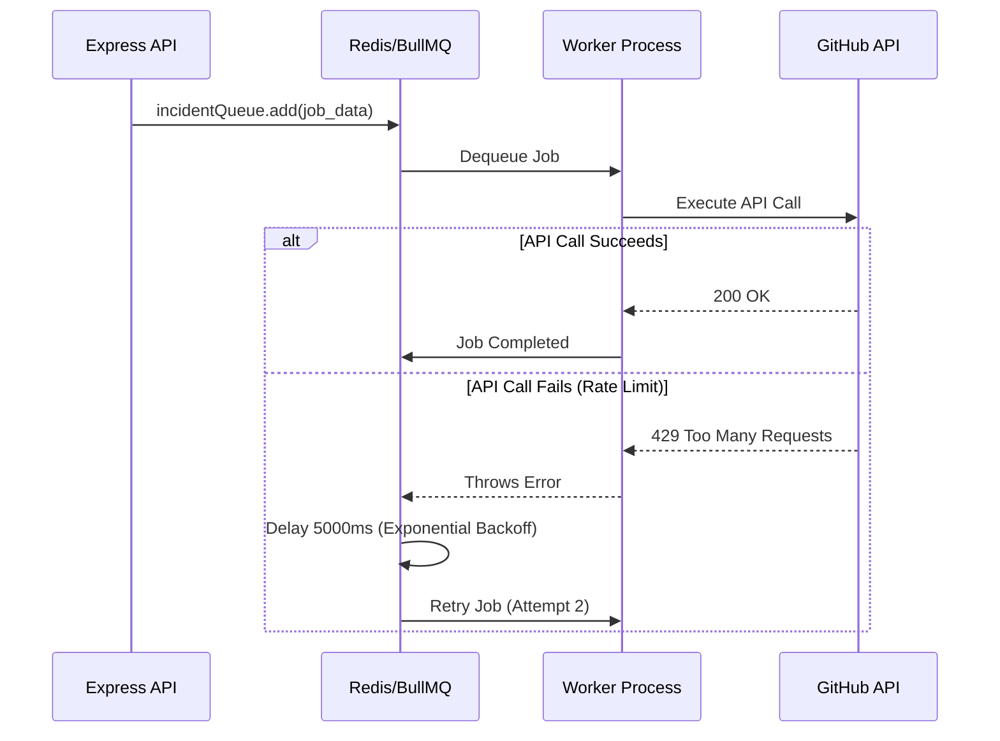
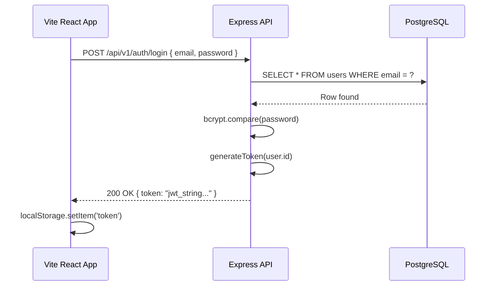

# 15 Sequence Diagrams

This document contains detailed sequence diagrams for the core flows of WatcherAgent.

## 1. Main Business Flow (End-to-End Orchestration)

## 2. Queue Processing & Retry Sequence

## 3. User Login Sequence

