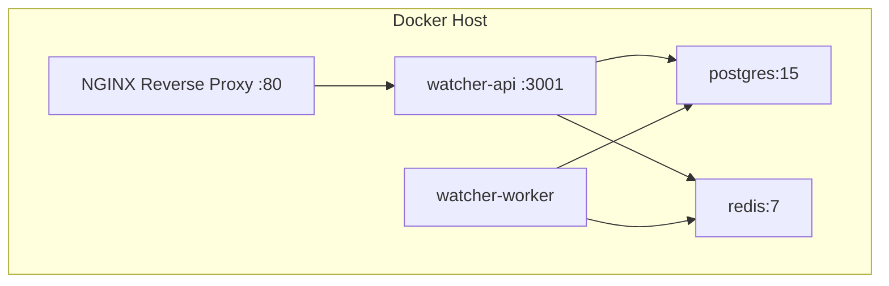

# 16 Component Diagrams

This document visualizes the physical and logical components that comprise WatcherAgent.

## 1. High-Level Component Architecture

```mermaid
componentDiagram
    package "Client Tier" {
        [React Dashboard]
        [Next.js App]
    }
    
    package "API Tier" {
        [Express API Server]
        [Authentication Module]
        [Webhook Ingress Module]
    }
    
    package "Compute Tier" {
        [BullMQ Queue Manager]
        [Node.js Worker Process]
        [WatcherAI Core Library]
    }
    
    package "Persistence Tier" {
        [PostgreSQL Database]
        [Redis Datastore]
    }
    
    package "External Services" {
        [GitHub API]
        [Pinecone DB]
        [OpenRouter API]
        [Discord Bot API]
        [Datadog / Sentry]
    }
    
    [React Dashboard] --> [Authentication Module] : HTTPS/REST
    [Next.js App] --> [PostgreSQL Database] : Prisma/TCP
    
    [Datadog / Sentry] --> [Webhook Ingress Module] : HTTPS/Webhook
    [Webhook Ingress Module] --> [PostgreSQL Database] : pg/TCP
    [Webhook Ingress Module] --> [BullMQ Queue Manager] : Enqueue Job
    
    [BullMQ Queue Manager] --> [Redis Datastore] : TCP
    [Node.js Worker Process] --> [Redis Datastore] : Poll/TCP
    
    [Node.js Worker Process] --> [WatcherAI Core Library] : Import
    
    [WatcherAI Core Library] --> [GitHub API] : HTTPS
    [WatcherAI Core Library] --> [Pinecone DB] : HTTPS/gRPC
    [WatcherAI Core Library] --> [OpenRouter API] : HTTPS
    [WatcherAI Core Library] --> [Discord Bot API] : WSS/HTTPS
```

## Component Responsibilities

1. **Express API Server**: Serves as the public-facing entry point. Exposes `PORT 3001` via Docker. Highly I/O bound.
2. **Node.js Worker Process**: Serves as the internal background processor. Never exposed to the public internet. Highly CPU/Network bound.
3. **WatcherAI Core Library**: A stateless, functional pipeline of AI logic (`runPhase1`, `runPhase2`). Exists as a local filesystem module imported by the Worker.
4. **Redis Datastore**: Holds ephemeral state regarding which jobs are waiting, active, or failed.
5. **PostgreSQL Database**: Holds persistent state regarding project configurations, incident history, and run logs.

## Deployment View

WatcherAgent is typically deployed via Docker Compose onto a single VPS (Virtual Private Server) or AWS EC2 instance.


